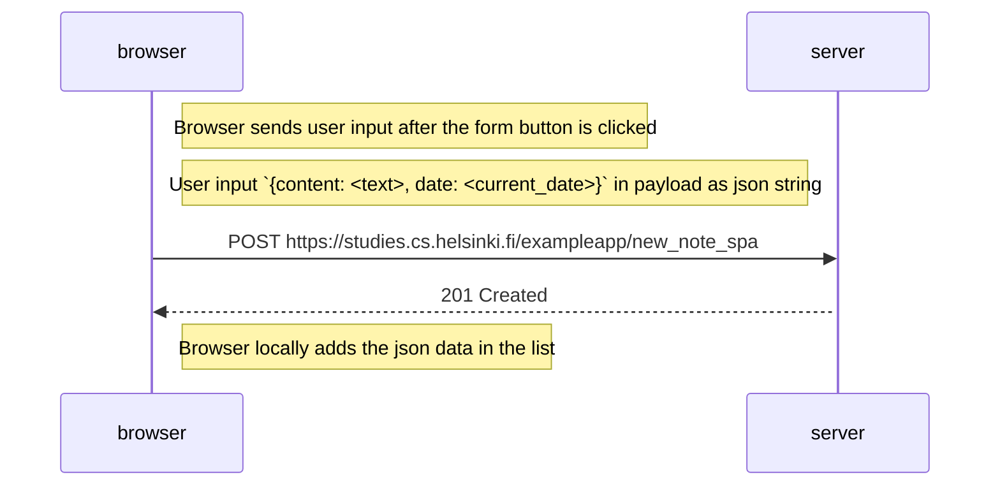

```mermaid
sequenceDiagram
    participant browser
    participant server

    Note right of browser: Browser sends user input after the form button is clicked
    
    Note right of browser: User input `{content: <text>, date: <current_date>}` in payload as json string

    browser->>server: POST https://studies.cs.helsinki.fi/exampleapp/new_note_spa
    activate server
    server-->>browser: 201 Created

    Note right of browser: Browser locally adds the json data in the list
```
